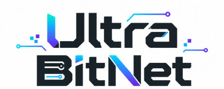
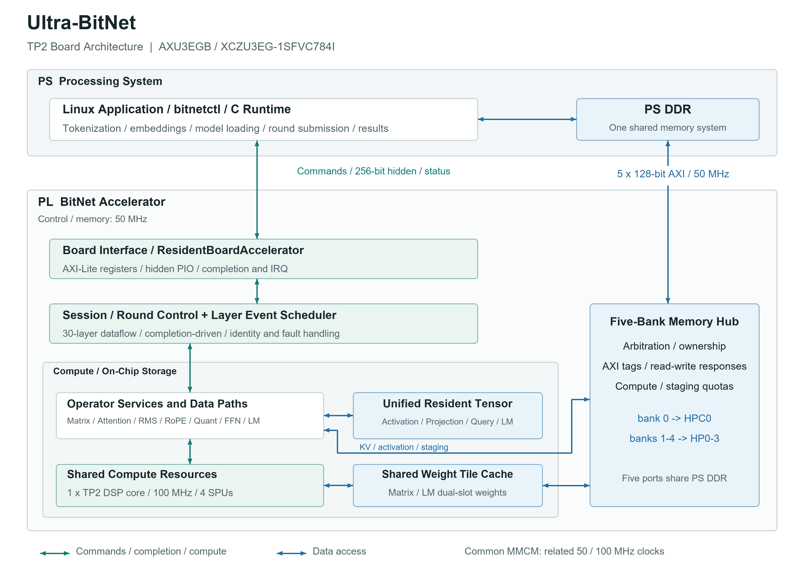
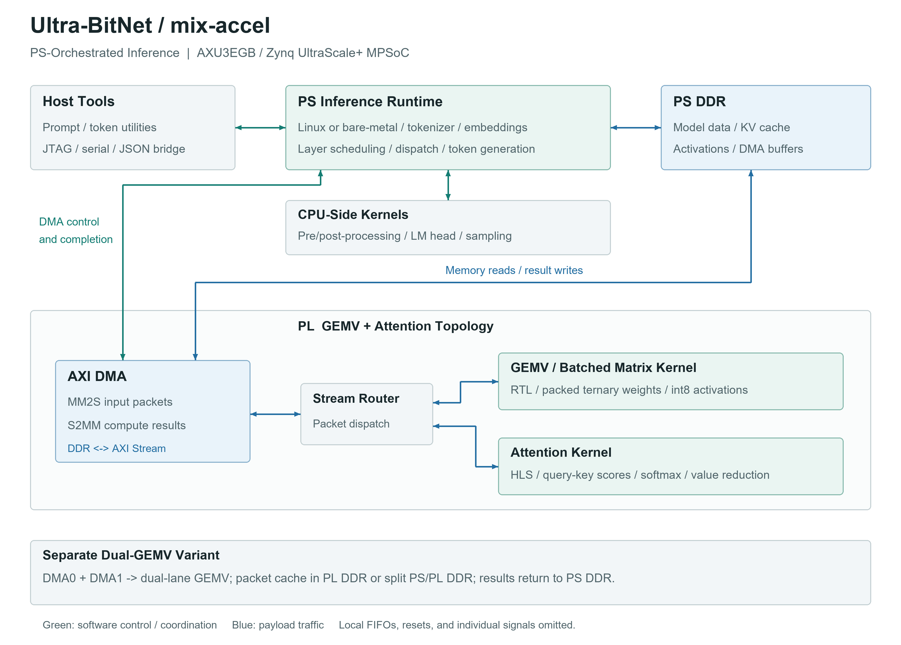

<p align="center">
  
</p>

# Ultra-BitNet

Two BitNet accelerator implementations for the AXU3EGB / Zynq UltraScale+ MPSoC platform. **pure-accel** places Transformer execution and scheduling in programmable logic (PL). **mix-accel** combines a processing-system (PS) inference runtime with PL compute kernels.

Each implementation retains its own source tree, documentation, build flow, and release assets. Run implementation-specific commands from the corresponding directory. Their bitstreams, host protocols, memory maps, and model layouts are not interchangeable.

## Implementations

| | pure-accel | mix-accel |
| --- | --- | --- |
| Execution model | PL-resident, event-driven layer and session scheduling | PS-managed layer execution with PL kernel offload |
| Hardware | Scala / SpinalHDL; TP2, one shared matrix engine, four SPUs | Verilog/SystemVerilog GEMV, HLS Attention, AXI DMA; dual-GEMV variants |
| PS responsibilities | Model loading, embeddings, round submission, result handling | Model loading, tokenization, layer orchestration, software kernels, accelerator dispatch |
| Memory organization | Five AXI access ports to shared PS DDR | DMA-backed PS DDR; optional PL DDR and split-memory packet-cache paths |
| Software | Portable C round driver and Linux UIO CLI | Bare-metal and Linux runtimes, plus PC-side JTAG/serial tools |
| Entry point | [pure-accel/README.md](pure-accel/README.md) | [mix-accel/README.md](mix-accel/README.md) |

## pure-accel

The PL owns the 30-layer execution flow, including matrix operations, attention, normalization, activation processing, and final LM/argmax. Identity-bearing commands and completions coordinate shared compute and resident tensor storage. The board configuration uses related 50 MHz control/memory and 100 MHz compute clocks.



[Architecture](pure-accel/doc/ARCHITECTURE.md) · [Build and Linux deployment](pure-accel/doc/BUILD.md) · [Scalable diagram](pure-accel/doc/assets/architecture.svg) · [Released bitstream](pure-accel/build/ultra_bitnet_tp2.bit)

Run the Linux host tests:

```sh
cd pure-accel
make -C src/software test
```

## mix-accel

The PS runtime manages inference and invokes PL GEMV/Attention kernels through packetized AXI DMA transfers. CPU-side processing, model conversion, bare-metal/Linux execution, and PC transport tools are provided alongside the accelerator sources. The hardware tree also includes a dual-GEMV topology with PL-DDR or split PS/PL-DDR packet storage; select the matching software and release assets for that topology.



[Operation guide](mix-accel/docs/OPERATION_GUIDE.md) · [Linux runtime](mix-accel/src/hardware/linux/README.md) · [Performance notes](mix-accel/docs/PERFORMANCE.md) · [Release assets](mix-accel/src/hardware/release/axu3egb/README.md) · [Scalable diagram](mix-accel/docs/assets/architecture.svg)

Run the Linux host regression:

```sh
cd mix-accel
bash src/hardware/scripts/evaluate_host.sh
```

## Repository Layout

```text
Ultra-BitNet/
|-- LOGO.png
|-- README.md
|-- pure-accel/
|   |-- doc/
|   |-- src/
|   `-- build/ultra_bitnet_tp2.bit
`-- mix-accel/
    |-- docs/
    `-- src/
        |-- hardware/
        |-- models/
        |-- pc/
        `-- tools/
```

The directories originate from `pure-AXU3EGB-accel` and `pure-bitnet-open-source`, respectively. Each includes its original project license and implementation documentation.

## Model and Release Downloads

Download the packed source model from [Microsoft BitNet b1.58 2B 4T on Hugging Face](https://huggingface.co/microsoft/bitnet-b1.58-2B-4T), or use an existing local copy. Generate deployment BIN files locally; generated weight packages are not committed. See [pure-accel model export and loading](pure-accel/doc/BUILD.md#model-images-and-loading) for the complete flow, including Map1-to-Map0 conversion and five-bank image generation.

```sh
cd pure-accel
python3 -m pip install numpy
python3 src/software/tools/export_model.py --model-dir /path/to/bitnet-source --output build/model-export
```

The imported `mix-accel` tree retains its existing Git LFS pointers for model and board release assets. Download only board release assets when using your own local model:

```sh
git lfs install
git lfs pull --include="mix-accel/src/hardware/release/**" origin public
```

Host software regression tests do not need the large model payloads. Model preparation and board deployment requirements are documented within each implementation.

## License

Project-owned source is distributed under the BSD 3-Clause licenses in [pure-accel/LICENSE](pure-accel/LICENSE) and [mix-accel/LICENSE](mix-accel/LICENSE). Model files, board assets, and third-party components retain their respective licenses; see the implementation-specific notices before redistribution.
